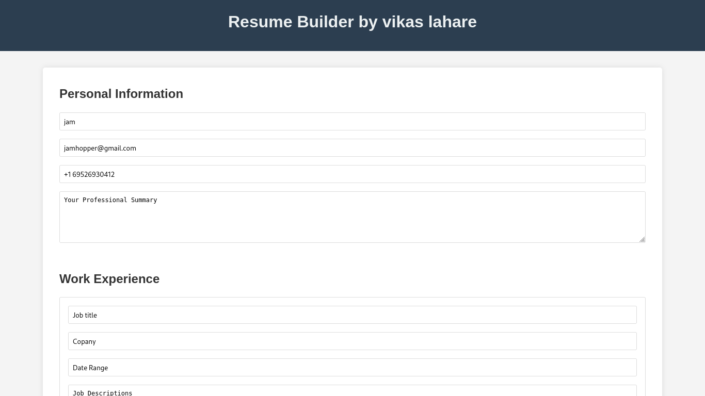
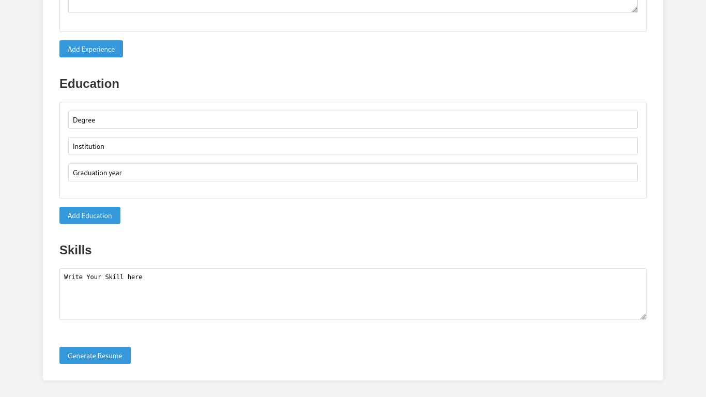
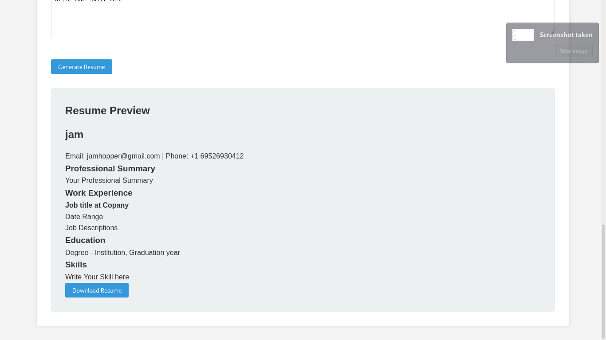

# Responsive-ResumeBuilder

> This is a simple ResumeBuilder Website.
> If you want to **add more features or modify** according to you..

# **Languages:**
> HTML CSS JAVASCRIPT PHP ``I'm using internal css and javascript so remember this.``

# Description:
> 1. Download resume builder or clone you want directory.
> 2. **Linux :** Extract in the apache server ``/var/www/html/``
> 3. **Windows :** Extract in the xampp server on ``/htdocs`` folder
> 4. and go to browser search ``localhost/Responsive-ResumeBuilder/index.html``
> 5. fill up the all ``requirements fields.``
> 6. click ``generate button`` and you got ``generated resume.``
> 7. enoyy..

```
git clone https://github.com/CryptoQuestVikas/Responsive-ResumeBuilder.git
cd Responsive-ResumeBuilder
```
# **Screenshot**



